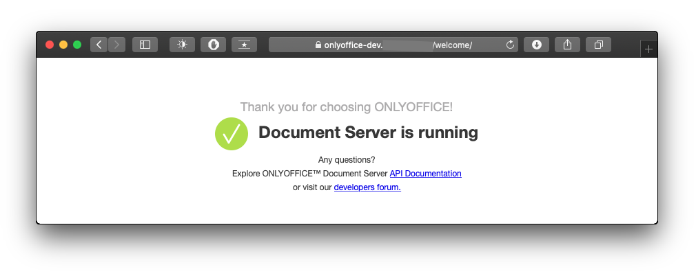

# onlyoffice-kubernetes
Onlyoffice Document Server - Kubernetes manifests

Kubernetes templates manifests based on [ONLYOFFICE Docker-DocumentServer](https://github.com/ONLYOFFICE/Docker-DocumentServer).

## Assumptions

- NFS Provisioner storage class called "nfs-client" has been previously configured.
- LoadBalancer funcionality can be achieved either via Cloud Provider or [MetalLB](https://metallb.universe.tf) project. This is an [example](yamls/example_onlyoffice-documentserver-lb.yaml)
- HTTPS is desired and Onlyoffice SSL secret containing certificate and private key exists. If not, follow [this example](yamls/example_onlyoffice-ssl_secret.yaml).

## Files

- Namespace: 
	- 0-onlyoffice-namespace.yml
- Persistent Volume Claims: 
	- 1-onlyoffice-documentserver-pvc.yaml
	- 2-onlyoffice-postgresql-pvc.yaml
- PostgreSQL:
	- 3-onlyoffice-postgresql-deployment.yaml
	- 4-onlyoffice-postgresql-service.yaml
- RabbitMQ:
	- 5-onlyoffice-rabbitmq-deployment.yaml
	- 6-onlyoffice-rabbitmq-service.yaml
- Onlyoffice Document Server:
	- 7-onlyoffice-documentserver-deployment.yaml
	- 8-onlyoffice-documentserver-service.yaml

## Screenshot

